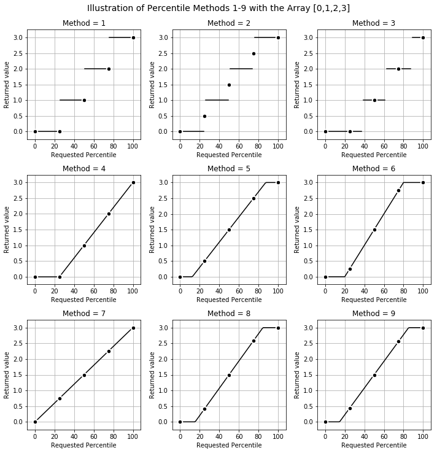

The [percentile](percentile.py) function computes the requested percentiles of a given distribution, with any of the 9 most common methods described by [Hyndman & Fan (1996)](https://www.researchgate.net/profile/Rob_Hyndman/publication/222105754_Sample_Quantiles_in_Statistical_Packages/links/02e7e530c316d129d7000000.pdf). 

Complements the numpy.percentile function, which only contains method 7.

The [percentile_single_formula](percentile_single_formula.py) employs the same formula for all the methods. This is less efficient for continuous methods (4-9), and was included for educational purposes. 

MIT License

